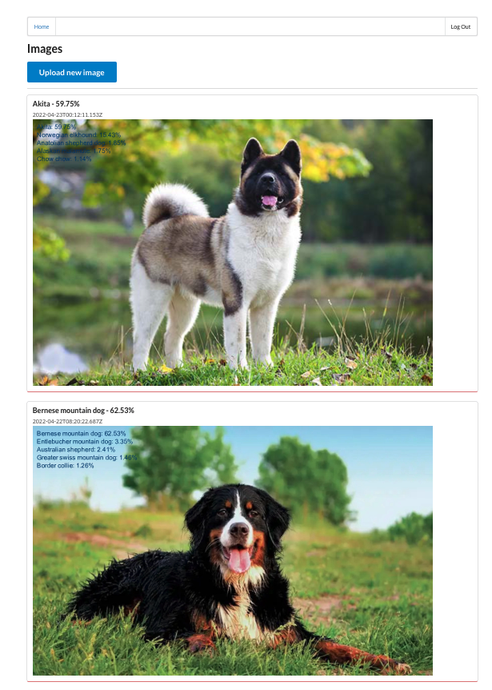
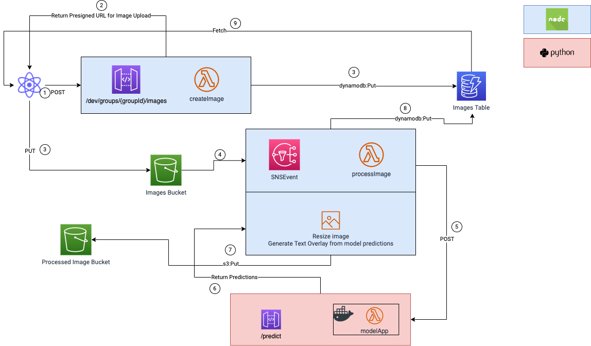

# udacity-clouddeveloper-capstone
Capstone project for the Udacity Cloud Developer Nanodegree

<!--  -->


## Project description
This project is an serverless image sharing application, similar to the Udagram from lesson 4, but with a twist:

Upon upload of an image **an AI model is triggered which tells the user what object is displayed in the image**.

We call this app *Udagram Redux*.

This image is then processed into a uniform size and a text overlay is projected onto the image which shows the top5 most likely object classes + their probabilities as calculated by the model.

Currently there is only one AI model active which has been trained to distinguish dog breeds. Therefore the current version of the app only works on dog images (of course it's also possible to upload images of other objects but the model predictions will still be dog breeds)


As this is intended to be an image sharing application users are supposed to see all avaible content on the website. It would not make sense to restrict the users to only see the content they have uploaded.

However we do restrict the use of the application through authentication in the way that only authenticated users are allowed to upload images (the same way the Udagram app from lecture 4 is designed). In other words, everyone can see the content of the website, but only authenticated users are allowed to create new content.

However due to the nature of this application this project automatically fails the authentication project rubric.

## Architecture and how this application works



The user logs into the application and is redirected to the home page. The user can browse *groups* (or "object categories") and see *images* that other users have uploaded. The user can then create new groups and/or upload images within any group.


So far this is the same as the same functionality as the Udagram app from lesson 4.

However the key difference is now that the image upload to the S3 bucket triggers a lambda function which calls the endpoint of an image classification model which then returns the top5 most likely object classes and their probabilities.

Concretely the flow of data for creating an image is as follows:

1. A POST request is sent by the client to the `createImage` API Gateway for a specific groupId.
2. A presigned URL is generated and returned to the client. 
3. A subsequent PUT request to the presigned URL loads the image into the image S3 bucket.
4. A SNSEvent is configured to then trigger a lambda function called `processImage` when the image is uploaded to S3. This lambda function's purpose is to process the image. First the image is supposed to be overlayed with text that shows the top5 most likely object classes (or here: dog breeds) and their probabilities.
5. This is done by sending a POST request to the `predict` API Gateway with the imageUrl in the request payload. This gateway triggers a lambda function implemented in `python` which gets the image from the URL and generates a prediction of the top 5 most likely classes + their probabilities.
6. These predictions are returned in the response payload which looks like
```json
    {
        "imageUrl": "https://bucket-name.s3.amazonaws.com/imageId",
        "top5": ["German shepherd", 
                 "Labrador retriever", 
                 "Golden retriever", 
                 "Poodle", 
                 "Beagle"],
        "prob5": [0.6, 0.2, 0.1, 0.06, 0.04]
    }
```
This body is used to generate a text overlay in the form of 
```text
German shepherd - 60.0%
Labrador retriever - 20.0%
Golden retriever - 10.0%
...
```
which is then overlayed onto the image. Furthermore the image is resized to a uniform width of 1000px. This is done with `Jimp`
7. The processed image is then uploaded to another S3 bucket which only stores these processed images.
8. Then the image dynamodb table is updated by replacing the original title (that the user can specify when uploading the image) with the most likely dog breed + its probability, i.e. `German shepherd - 60.0%`. Furthermore we update the `processedImageUrl` field of the image dynamodb table  with the URL of the processed image. This is a new field that is introduced which is initialized to `null` when the original image is created, but is now being updated with the new Url. The Url has the same structure as the original image URL `https://bucket-name.s3.amazonaws.com/imageId` where the imageId stays the same but the bucket name is replaced by that of the processed image`s S3 bucket.
9. Finally the client fetches this new image item from the image dynamodb. For the correct image to be display the React frontend has to be modified to display the processedImageUrl instead of the old imageUrl. The title will be updated automatically.


## Application structure

The application has 3 components

|          	| language 	| description                                                                                                                 	|
|----------	|----------	|-----------------------------------------------------------------------------------------------------------------------------	|
| Backend  	| nodejs   	| Reused a large part of the backend from lecture 4, but refactored  Also added some lambda functions and resource components 	|
| Frontend 	| React    	| Pretty much the same frontend from lecture 4                                                                                	|
| Model    	| python   	| The model backend infrastructure for obtaining predictions  Implemented using python and deployed with serverless           	|

These components will be described in more detail in the following sections.


### Backend

The backend portion relies in large parts on the same code as from lecture 4. Almost all key lambda functions are re-used. However I also added some modifications and refactored the code.

The first decision I made was to keep the `Group` -> `Image` hierarchy. 

> **_NOTE:_** Alternatively `Groups` could have been removed which would have changed this app into an image sharing application for only Dog pictures. However that would mean that the frontend would have to be modfied as well, (which I have 0 experience in) so in the end I decided to not go through with it.

**Authorization**

Instead of using the authorization code from the lecture where secrets are stored in AWS KMS I changed it into the scheme from the Serverless Todo-App where the certificate is downloaded from the Auth0 JWKS Endpoint which is then used to verify tokens.

**Lambda functions** 

Removed some of the lambda functions from lecture 4 (such as the connect and disconnect handlers) as they were not needed for this project, but most of the lambda functions are re-used.

A key difference is that a lambda function called `processImage` is added which is triggered by an SNSEvent, i.e. when a file is uploaded to the image S3 bucket. This then triggers the whole workflow described in the section above.

One thing that should be mentioned is how the dynamodb table entry is updated. For this a new field called `processedImageUrl` has been added which is initialized to `null` when the original image is created. After image has been processed, this table entry needs to be updated. First we get the corresponding entry from the table (`dynamodb:GetItem`) and then we replace the fields `title` and `processedImageUrl` with the new values. To keep things simple, the old item is being **replaced** by the new item instead of updated (which would require restructuring the image table key schema), i.e. a `PutItem` operation is performed instead of `UpdateItem`.


**Resources**

Pretty much the same resources as in lesson 4 are used. Some resources that are irrelevant to this project have been removed. A new S3 bucket for storing the processed images has been added.

**Code Refactoring**

Code has been refactored to separate business logic and data access. (Similar to what has been done for the Todo App Project)

Xray tracing is enabled and `middy` is used to simplify the AWS lambda code.

Logging statements are added to make debugging easier.

**Deployment** 

- `node`: v12.22.9
- `npm`: 6.14.15
- `serverless`: Framework Core: 1.74.1, Plugin: 3.8.4, SDK: 2.3.2, Components: 2.34.9


### Frontend

The same frontend is used as in lecture 4. I only added a function in `groups-api.ts` for obtaining predictions from the model endpoint. This can e.g. be used to change the alert text upon image upload to show the prediction results (although I decided to not go through with it). Furthermore I made a change to the `UdagramImage.tsx` to pull the image for display from the processedImageUrl instead of the original imageUrl.


### Model
Currently there is one model deployed for classifying dog breeds. The model is a `pytorch` implementation of `efficientnetb2` which is trained on the dataset from the Dog-Breed-Classifier project from Udacity's Deep Learning Nanodegree. It contains 133 dog breeds. The model is deployed as a serverless application, separated from the `nodejs` backend.

**Lambda functions**
There is only one lambda function required which connected to an API Gateway. This API is triggered by sending a POST request to the `/predict` endpoint while passing the images URL in the request body

```json
{"url": "https://bucket-name.s3.amazonaws.com/imageId"}
```
(can be any image URL, not restricted to only images in S3)
The image is then read, transformed into a `PILImage` and passed to the model to make a prediction. The model returns a list of the top 5 predictions and their probabilities for the given image.

> **_NOTE:_** Due to the size limitation of AWS Lambda it would be cumbersome, if not impossible to deploy this lambda function directly since there are dependencies to some python packages (e.g. `pytorch` alone is almost 200 MB). Therefore as an alternative this lambda function is embedded into a Docker image that has been built and pushed to AWS ECR.

In the Docker image the required python libraries are installed during the build process and are thus available at runtime.

When testing this endpoint it was found that the process would time out often, especially during the initial call due to the Lambda coldstart problem. As a solution I have increased the timeout to the maximum 30 seconds and have increased the memory size to 4GB, so that the image would be processed faster.


**Authorization**

I thought of adding authorization to the prediction API but this turns out to create additional overhead which makes things more complicated. This is because
in the backend the prediction is triggered by an SNSEvent where there is no auth Token available that can be verified (or at least that I know of). This would be a different story if the prediction were triggered by an API request since we could then just pass the event's auth token along. 

Therefore I decided to not add authorization to the prediction API, but have nevertheless added a lambda function for authorization as well as created a second API for the prediction endpoint which requires authorization, just to demonstrate how an authorization protected prediction endpoint would look like. This can be tested via the Postman collection.

**Deployment**

- `python`: 3.8
- `node`: v14.18.3
- `npm`: 6.14.15
- `serverless`: Framework Core: 3.14., Plugin: 6.2.1, SDK: 4.3.2

I originally wanted to merge the model and the application backend and deploy both using one `serverless.yaml` file. However I was not able to do so since the app backend and the model require different versions of `node` and `serverless`. The detailed explanation is mentioned in the `serverless.yaml` file of the model.


## Limitations and hypothetical improvements

- Allow users to delete images (that they have created) as well as groups
- The image processing can take a bit due to the Lambda cold start problem if no image has been uploaded in a long time. This can result in the image taking some time to be shown in the frontend after it has been uploaded. Usually waiting for a few seconds and refreshing the browser can help. Subsequent image uploads are then faster.
